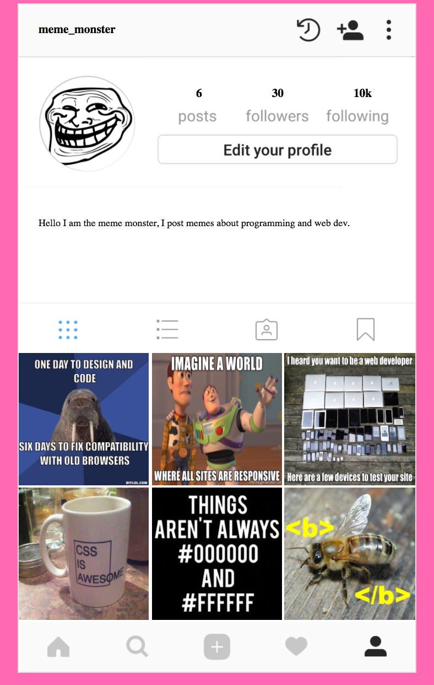

# Welcome To Instagram!
You will be recreating your personal instagram profile!

## Before you begin
Please create a mockup of your profile for an instructor to approve :)

## Set-up your files
Please create the following files:
- index.html
- styles.css

Create a link tag for your CSS stylesheet in your html document.

<b>Here's an example of your final product:</b>
</img>

## HTML
1. Create a header containing your username of your instagram profile using a **header** tag

2. Create a container for all of your icons and pictures using a **div** tag and set the value of the id attribute to `container`

3. Within your container div, in chronological order: 
  - Create a **div** tag with an id of `top-bar`
  - Create a **div** tag with an id of `follower-count`
  - Create a **div** tag with an id of `bio`
  - Create a **div** tag with an id of `photo-bar`
  - Create a **div** tag with an id of `pictures`
  - Create a **div** tag with an id of `bottom-bar`

4. Inside the **div** with the id of `top-bar`, create a header using the **h1** tag containing your IG username; give this header an id of `username`

5. Inside the **div** with the id of `follower-count`, add an **image** tag with an id of `profile-picture`

6. Inside the **div** tag with an id of `bio`, add a **paragraph** tag containing information about you

7. Inside the **div** tag with an id of `pictures`, add a **minimum of six** pictures using **image** tags assigning each with a *class* of `image`

*BONUS* Wouldn't it be cool if each profile could make a sound? Add an audio tag to each pet profile.

## CSS
1. Set the background color of the body using the `element` selector.

2. Using the `id` selector, modify the container accordingly: 
  - Assign it a width of 1080 pixels
  - Align it in the center of the page
  - Set the background color to white
  - Using the **border** property, add a *solid* border with a 3px width and hex color #DDDDDD

3. Using the `id` selector, modify `top-bar` accordignly:
  - Assign it a height of 145 pixels
  - Set the background image to `Top-Bar.png` found in the *images* folder
  - Ensure that the background image does not repeat (hint: `norepeat`)

4. Using the `id` selector, center your username within the `top-bar` (hint: `inline-block`, margin-left, margin-top)

5. Using the `id` selector, modify `follower-count` accordignly:
  - Assign it a height of 355 pixels
  - Set the background image to `Follower-Count.png` found in the *images* folder

6. Using the `id` selector, modify `profile-picture` accordignly:
  - Crop your profile picture to the shape of a circle (hint: border-radius)
  - Assign it a height and width of 255 pixels
  - Using margin-top and margin-left, position your profile pic within the background circle

7. Using the `id` selector, modify `photo-bar` accordignly:
  - Assign it a height of 140 pixels
  - Set the background image to `Photo-Bar.png` found in the *images* folder

8. Using the `class` selector, modify each picture/image so that there are only *three* images per row with each being square shaped (hint: use the display property to align images side by side while using **percentage** for the width of the image)

9. Using the `id` selector, modify `bottom-bar` accordignly:
  - Assign it a height of 135 pixels
  - Set the background image to `Bottom-Bar.png` found in the *images* folder

10. Continue modify your elements with these style attributes:
  - `padding`
  - `margin`
  - `font-size`
  - `font-family`
  - `height`
  - `width`
  - `text-align`

## Stretch Goals:
  - Use a **hover** pseudo selector to enlarge the picture when hovering over it
  - Add more pictures while maintaining 3 pictures per row
  - Since IG lets users post videos, add a video to you profile with **video** tag
  - Currently there are no numbers above your followers and posts, add numbers above it
